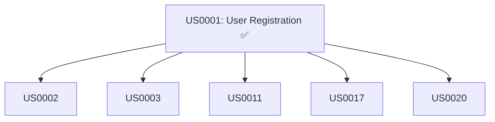

# Story Dependencies Graph

This document maps all story dependencies to help the team understand what can be worked on in parallel and what requires sequential completion.

> **Last Updated:** 2026-01-30
> **Total Stories:** 28 (US0001-US0028)

---

## 📊 Dependency Overview

### Critical Path
The **critical path** is the longest sequence of dependent stories. Completing these unblocks the most work.

```
US0001 → US0002 → US0003 → EP0002, EP0003, EP0004, EP0005
```

**Timeline:**
- Week 1: US0001 ✅, US0002, US0003 (Richard)
- Week 2-3: All other epics can proceed in parallel

### Parallel Work Opportunities

| Week | Richard | Mark | Ethel | Neildren |
|------|---------|------|-------|----------|
| 1 | US0001 ✅<br>US0002<br>US0003 | Planning EP0002 | US0011 (Photo model)<br>US0012 (S3 setup) | US0017 (Like model)<br>US0020 (Follow model) |
| 2-3 | US0004<br>US0005 | US0006-US0010 | US0013-US0015 | US0016-US0022 |
| 4+ | US0023-US0028 | Available | Available | Available |

---

## 🔗 Story Dependency Graph

### Legend
- ✅ **Done** - Story completed and merged
- 🔄 **Ready** - No blockers, can start immediately
- 🔒 **Blocked** - Waiting on other stories
- 🚧 **In Progress** - Currently being worked on

---

## EP0001: User Authentication (Richard)

### US0001: User Registration API ✅
**Status:** Done (2026-01-30)
**Dependencies:** None
**Blocks:** All other stories (foundational)



### US0002: User Login & JWT Token 🔄
**Status:** Ready (Next for Richard)
**Depends on:** US0001 ✅
**Blocks:** US0003, US0004, US0005

```
US0001 ✅ → US0002 🔄 → US0003 🔒
```

### US0003: JWT Auth Middleware 🔒
**Status:** Blocked
**Depends on:** US0002
**Blocks:** All protected endpoints (US0004, US0006, US0008, US0012, US0016, US0019, US0023)

```
US0002 → US0003 🔒 → [All Protected Routes]
```

### US0004: Get User Profile Endpoint 🔒
**Status:** Blocked
**Depends on:** US0003
**Blocks:** Frontend user profile stories

### US0005: User Registration Frontend 🔒
**Status:** Blocked
**Depends on:** US0001 ✅
**Blocks:** None

---

## EP0002: User Profiles (Mark)

### US0006: View User Profile API 🔒
**Status:** Blocked
**Depends on:** US0001 ✅, US0003 (auth middleware)
**Blocks:** US0010 (Profile Navigation)

```
US0001 ✅ ──┐
            ├─→ US0006 🔒 → US0010 🔒
US0003 🔒 ──┘
```

### US0007: Profile Photo Grid Component 🔒
**Status:** Blocked
**Depends on:** US0006 (profile data), US0011 (Photo model)
**Blocks:** None

```
US0006 🔒 ──┐
            ├─→ US0007 🔒
US0011 🔄 ──┘
```

### US0008: Edit Profile API and UI 🔒
**Status:** Blocked
**Depends on:** US0003 (auth), US0006 (view profile)
**Blocks:** None

```
US0003 🔒 ──┐
            ├─→ US0008 🔒
US0006 🔒 ──┘
```

### US0009: Upload/Update Profile Picture 🔒
**Status:** Blocked
**Depends on:** US0008 (edit profile), US0012 (S3 upload service)
**Blocks:** None

```
US0008 🔒 ──┐
            ├─→ US0009 🔒
US0012 🔄 ──┘
```

### US0010: Profile Page Routing and Navigation 🔒
**Status:** Blocked
**Depends on:** US0006 (profile API), US0007 (photo grid)
**Blocks:** None

```
US0006 🔒 ──┐
            ├─→ US0010 🔒
US0007 🔒 ──┘
```

---

## EP0003: Photo Upload & Storage (Ethel)

### US0011: Photo Model and MongoDB Schema 🔄
**Status:** Ready (Ethel can start now)
**Depends on:** US0001 ✅ (User model exists)
**Blocks:** US0012, US0013, US0014, US0007, US0023

```
US0001 ✅ → US0011 🔄 → [All Photo Features]
```

**Note:** This is **schema-only work** and can be done in parallel with US0002/US0003.

### US0012: Photo Upload API with S3 Integration 🔒
**Status:** Blocked
**Depends on:** US0011 (Photo model), US0003 (auth)
**Blocks:** US0009 (profile picture upload uses same service), US0015 (frontend)

```
US0011 🔄 ──┐
            ├─→ US0012 🔒 → US0009 🔒
US0003 🔒 ──┘              → US0015 🔒
```

**Shared Service:** Creates S3 upload service used by US0009

### US0013: File Validation (Type, Size, Format) 🔄
**Status:** Ready (Can work alongside US0011)
**Depends on:** None (pure validation logic)
**Blocks:** US0012 (validation used in upload)

```
US0013 🔄 → US0012 🔒
```

**Note:** Can be implemented in parallel as standalone utility.

### US0014: Photo Deletion (MongoDB + S3 Cleanup) 🔒
**Status:** Blocked
**Depends on:** US0012 (upload/storage established)
**Blocks:** None

```
US0012 🔒 → US0014 🔒
```

### US0015: Photo Upload Frontend Component 🔒
**Status:** Blocked
**Depends on:** US0012 (upload API)
**Blocks:** None

```
US0012 🔒 → US0015 🔒
```

---

## EP0004: Social Interactions (Neildren)

### US0016: Like/Unlike Photo API Endpoints 🔒
**Status:** Blocked
**Depends on:** US0017 (Like model), US0011 (Photo model), US0003 (auth)
**Blocks:** US0018, US0021

```
US0003 🔒 ──┐
US0011 🔄 ──┼─→ US0016 🔒 → US0018 🔒
US0017 🔄 ──┘              → US0021 🔒
```

### US0017: Like Model and Denormalized Count Logic 🔄
**Status:** Ready (Neildren can start now)
**Depends on:** US0001 ✅ (User model), US0011 (Photo model)
**Blocks:** US0016, US0018, US0021

```
US0001 ✅ ──┐
            ├─→ US0017 🔄 → [Like Features]
US0011 🔄 ──┘
```

**Note:** Can start schema design now, wait for US0011 to merge before implementation.

### US0018: View Photo Likes List 🔒
**Status:** Blocked
**Depends on:** US0016 (like/unlike API)
**Blocks:** None

```
US0016 🔒 → US0018 🔒
```

### US0019: Follow/Unfollow User API Endpoints 🔒
**Status:** Blocked
**Depends on:** US0020 (Follow model), US0003 (auth)
**Blocks:** US0022

```
US0003 🔒 ──┐
            ├─→ US0019 🔒 → US0022 🔒
US0020 🔄 ──┘
```

### US0020: Follow Model with Self-Follow Validation 🔄
**Status:** Ready (Neildren can start now)
**Depends on:** US0001 ✅ (User model)
**Blocks:** US0019, US0022, US0023 (feed needs follow relationships)

```
US0001 ✅ → US0020 🔄 → US0019 🔒 → US0022 🔒
                    → US0023 🔒
```

**Note:** Schema-only work, can start immediately.

### US0021: Like Button Component (Frontend) 🔒
**Status:** Blocked
**Depends on:** US0016 (like API)
**Blocks:** US0025 (photo card uses like button)

```
US0016 🔒 → US0021 🔒 → US0025 🔒
```

**Shared Component:** Used by US0025 (photo card in feeds)

### US0022: Follow Button Component (Frontend) 🔒
**Status:** Blocked
**Depends on:** US0019 (follow API)
**Blocks:** None

```
US0019 🔒 → US0022 🔒
```

---

## EP0005: Photo Feeds (Richard)

### US0023: Personalized Feed API Endpoint 🔒
**Status:** Blocked
**Depends on:** US0011 (Photo model), US0020 (Follow model), US0003 (auth)
**Blocks:** US0026

```
US0003 🔒 ──┐
US0011 🔄 ──┼─→ US0023 🔒 → US0026 🔒
US0020 🔄 ──┘
```

### US0024: Discovery Feed API Endpoint 🔒
**Status:** Blocked
**Depends on:** US0011 (Photo model)
**Blocks:** US0026

```
US0011 🔄 → US0024 🔒 → US0026 🔒
```

**Note:** Simpler than US0023 (no follow logic), but same Photo model dependency.

### US0025: Photo Card Component for Feeds 🔒
**Status:** Blocked
**Depends on:** US0021 (Like button)
**Blocks:** US0026

```
US0021 🔒 → US0025 🔒 → US0026 🔒
```

**Shared Component:** Reusable photo card for both feeds.

### US0026: Feed Page with Infinite Scroll 🔒
**Status:** Blocked
**Depends on:** US0023 (feed API), US0024 (discovery API), US0025 (photo card)
**Blocks:** None

```
US0023 🔒 ──┐
US0024 🔒 ──┼─→ US0026 🔒
US0025 🔒 ──┘
```

### US0027: Feed Empty State Handling 🔒
**Status:** Blocked
**Depends on:** US0026 (feed page)
**Blocks:** None

```
US0026 🔒 → US0027 🔒
```

### US0028: Feed Query Optimization 🔒
**Status:** Blocked
**Depends on:** US0023 (feed API implemented), US0024
**Blocks:** None

```
US0023 🔒 ──┐
            ├─→ US0028 🔒
US0024 🔒 ──┘
```

**Note:** Performance optimization, should be last in epic.

---

## 🚀 Recommended Execution Order

### Week 1: Foundation (Richard)
```
Day 1-2: US0001 ✅ (Done)
Day 3-4: US0002 🔄 (Login & JWT)
Day 5:   US0003 🔒 (Auth Middleware)
```

**Parallel Work (Other Developers):**
```
Ethel:    US0011 🔄 (Photo Model) - schema only
          US0013 🔄 (File Validation) - pure logic
Neildren: US0017 🔄 (Like Model) - schema only
          US0020 🔄 (Follow Model) - schema only
Mark:     Planning EP0002, reviewing specs
```

### Week 2-3: Feature Development (All Parallel)

**After US0003 completes, everything unblocks:**

```
Richard:  US0004, US0005 (complete EP0001)
Mark:     US0006, US0007, US0008, US0009, US0010 (EP0002)
Ethel:    US0012, US0014, US0015 (EP0003) - US0011 already done
Neildren: US0016, US0018, US0019, US0021, US0022 (EP0004) - US0017/US0020 already done
```

### Week 4+: Final Integration (Richard)

```
Richard: US0023, US0024, US0025, US0026, US0027, US0028 (EP0005)
```

---

## 🔍 Checking Dependencies Before Starting

### Command to Check Story Status

```bash
# Check if dependencies are met
cat sdlc-studio/stories/US0020-follow-model.md | grep -A 10 "Dependencies"

# Check dependency status
grep "Status:" sdlc-studio/stories/US0001-*.md
```

### Dependency Checklist Template

Before starting a story, verify:

```markdown
## US00XX Dependency Check

### Blocked By
- [ ] US00YY: Status = Done? (check story file)
- [ ] US00ZZ: Status = Done? (check story file)

### Shared Services Needed
- [ ] Service ABC: Available? (check SHARED_SERVICES.md)
- [ ] Service XYZ: Available? (check SHARED_SERVICES.md)

### Can I Start?
- [ ] All blockers resolved
- [ ] All shared services available or can implement inline
- [ ] No merge conflicts expected (check TEAM_ASSIGNMENTS.md)

✅ YES - Proceed with implementation
❌ NO - Wait or ask team to prioritize blockers
```

---

## 🎯 Quick Reference: What Can I Work On?

### If You Are Richard (EP0001)
```
✅ Now:  US0002 (Login)
Next:    US0003 (Auth Middleware)
Then:    US0004, US0005
Later:   US0023-US0028 (feeds - after everyone else completes)
```

### If You Are Mark (EP0002)
```
🔒 Blocked until: US0003 complete
🔄 Can do now:   Planning, spec review
✅ Then:         US0006, US0007, US0008, US0009, US0010 (all in parallel)
```

### If You Are Ethel (EP0003)
```
✅ Now:  US0011 (Photo Model) - schema work
✅ Now:  US0013 (File Validation) - pure logic
🔒 Wait: US0012, US0014, US0015 (need US0003 auth)
```

### If You Are Neildren (EP0004)
```
✅ Now:  US0017 (Like Model) - schema work
✅ Now:  US0020 (Follow Model) - schema work
🔒 Wait: US0016, US0018, US0019, US0021, US0022 (need US0003 auth + US0011 Photo model)
```

---

## 📊 Dependency Summary Table

| Story | Depends On | Blocks | Can Start? |
|-------|-----------|--------|------------|
| US0001 | None | Everything | ✅ Done |
| US0002 | US0001 | US0003 | ✅ Ready |
| US0003 | US0002 | All protected routes | 🔒 Blocked |
| US0006 | US0001, US0003 | US0010 | 🔒 Blocked |
| US0011 | US0001 | All photo features | ✅ Ready |
| US0013 | None | US0012 | ✅ Ready |
| US0017 | US0001, US0011 | Like features | 🔄 Can start schema |
| US0020 | US0001 | Follow features, feeds | ✅ Ready |

**Full table:** See individual epic sections above.

---

## 🔄 Updating This Document

When a story status changes:

```bash
# Update story status in this file
# Replace 🔒 with 🔄 or ✅

git add sdlc-studio/DEPENDENCIES.md
git commit -m "docs: Update US00XX status to Done in dependency graph"
git push
```

**Automated alternative:**
```bash
# SDLC Studio can auto-update this (future feature)
/sdlc-studio story review --update-dependencies
```

---

**Questions about dependencies?** Check the story's "Dependencies" section in `sdlc-studio/stories/US00XX-*.md` or ask in team chat! 🚀
